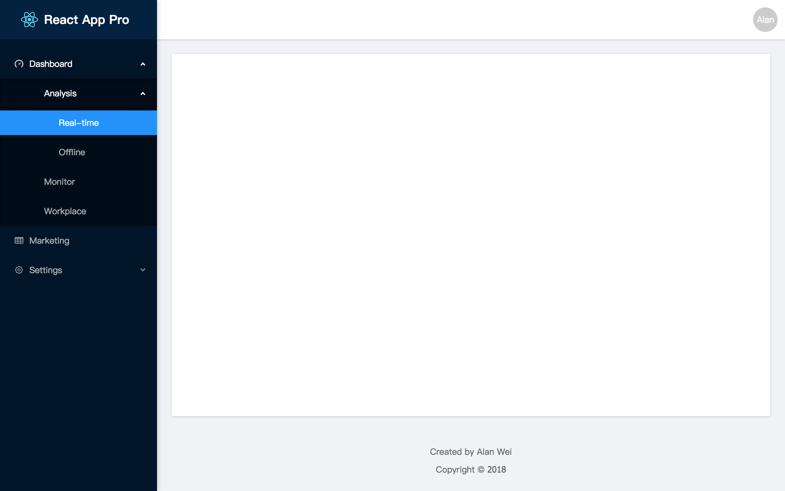

# react-sider

[](https://www.npmjs.com/package/react-sider)
[](https://www.npmjs.com/package/react-sider)

Inspired by [Ant Design Pro](https://pro.ant.design/).

Lightweight [Ant Design Pro](https://pro.ant.design/) like `<Sider />` component integrated with [Ant Design Menu](http://ant.design/components/menu/).

## Features
* Zero work on CSS.
* Minimum configuration and 100% data driven.
* Easy integration with any React app architectures. Only depends on `react`, `react-router-dom`, `lodash` & `antd`.
* Native nested menu and pathname support.
* Automatical menu `openKeys` & `selectKeys` match based on current page `pathname`.

## Installation

```bash
yarn add react-sider react react-router-dom lodash antd
```

## Preview



## Usage

### Sider
| Property   | Description                 | Type              | Default |
| ---------- | --------------------------- | ----------------- | ------- |
| className  | className of container      | string            | ''      |
| style      | style of container          | object            | { }     |
| appName    | name of application         | string            | ''      |
| appLogo    | img src of application logo | string            | ''      |
| appBaseUrl | href of sider header        | string            | '/'     |
| width      | sider container width       | number            | 256     |
| menuData   | data of sider menu          | arrayOf(MenuItem) | [ ]     |
| pathname   | current page pathname       | string            | '/'     |

### MenuItem
| Property | Description                                    | Type              | Default |
| -------- | ---------------------------------------------- | ----------------- | ------- |
| name     | menu item name in text                         | string            | -       |
| path     | menu item path (see below example for details) | string            | -       |
| icon     | menu item antd icon                            | string            | -       |
| children | sub menu items                                 | arrayOf(MenuItem) | -       |

## Example

```javascript
import ReactSider from 'react-sider';
import 'react-sider/lib/index.css';
import logo from 'assets/logo.svg';

const menuData = [{
  // MenuItem name
  name: 'Dashboard',
  // MenuItem icon (antd icon)
  icon: 'dashboard',
  // MenuItem relative path
  path: 'dashboard',
  // SubMenu
  children: [{
    name: 'Analysis',
    path: 'analysis',
    children: [{
      name: 'Real-time',
      path: 'realtime',
    }, {
      name: 'Offline',
      path: 'offline',
    }],
  },
  {
    name: 'Monitor',
    path: 'monitor',
  },
  {
    name: 'Workplace',
    path: 'workplace',
  }],
}, {
  name: 'Marketing',
  icon: 'table',
  path: 'marketing',
}, {
  name: 'Settings',
  icon: 'setting',
  path: 'settings',
  children: [{
    name: 'Users Management',
    path: 'users',
  }],
}];

const Sider = () => (
  <ReactSider
    appName="React App Pro"
    appLogo={logo}
    menuData={menuData}
    // better to sync pathname with the router in your application
    pathname={this.props.location.pathname}
  />
)

export default Sider;
```

## Notes
* `react-sider` will automatically format nested menu path with `/` based on `menuData` structure.
* Remember to config `less-loader` within your application building process since `react-sider` directly imports `antd` components styles.